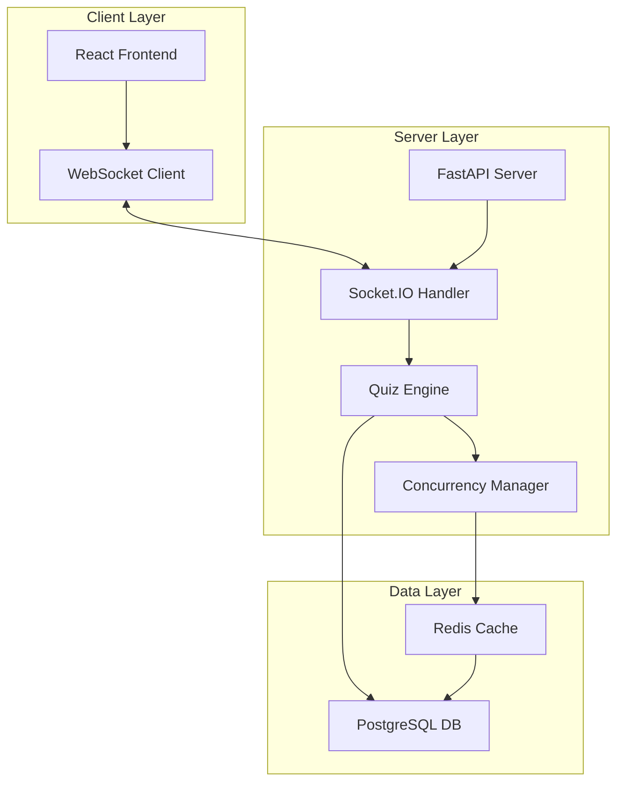

# Design Document

## Overview

The Competitive Math Quiz system is a real-time web application built with React frontend and Python backend. The architecture uses WebSockets for instant communication, Redis for state management and concurrency control, and PostgreSQL for persistent data storage. The system handles multiple concurrent users competing to solve math problems with fair winner detection and automatic question progression.

## Architecture

### High-Level Architecture



### Technology Stack

**Frontend:**
- React 18 with TypeScript for type safety
- Socket.IO client for real-time communication
- Tailwind CSS for responsive styling
- React Query for state management

**Backend:**
- FastAPI with Python 3.11 for high-performance async API
- Socket.IO for WebSocket management
- Redis for real-time state and concurrency control
- PostgreSQL for persistent data storage
- Pydantic for data validation
- Google Gemini API for AI-powered math problem generation

**Deployment:**
- Heroku for hosting (supports WebSockets)
- Redis Cloud for managed Redis instance
- Heroku Postgres for managed database

## Components and Interfaces

### Frontend Components

#### QuizInterface Component
```typescript
interface QuizState {
  currentProblem: MathProblem | null;
  timeRemaining: number;
  userAnswer: string;
  isSubmitting: boolean;
  winner: Winner | null;
  leaderboard: UserScore[];
}

interface MathProblem {
  id: string;
  question: string;
  difficulty: 'easy' | 'medium' | 'hard';
  createdAt: timestamp;
}
```

#### ScoreBoard Component
```typescript
interface UserScore {
  userId: string;
  username: string;
  totalWins: number;
  averageResponseTime: number;
  currentSessionScore: number;
}
```

### Backend Services

#### QuizEngine Service
```python
class QuizEngine:
    async def generate_problem_with_ai(self, difficulty: str) -> MathProblem
    async def validate_answer(self, problem_id: str, answer: float) -> bool
    async def get_current_problem(self) -> MathProblem | None
    async def rotate_question(self) -> MathProblem
    async def parse_ai_response(self, ai_response: str) -> MathProblem

class GeminiService:
    async def generate_math_problem(self, difficulty: str, topic: str) -> str
    async def validate_problem_format(self, problem: str) -> bool
```

#### ConcurrencyManager Service
```python
class ConcurrencyManager:
    async def submit_answer(self, user_id: str, problem_id: str, answer: float) -> SubmissionResult
    async def determine_winner(self, problem_id: str) -> Winner | None
    async def lock_problem(self, problem_id: str) -> bool
```

### WebSocket Events

#### Client to Server Events
- `join_quiz`: User joins the competition
- `submit_answer`: User submits an answer
- `request_current_problem`: Get current active problem

#### Server to Client Events
- `new_problem`: Broadcast new math problem to all users
- `winner_announced`: Announce winner and correct answer
- `answer_received`: Confirm answer submission received
- `leaderboard_update`: Update user scores
- `user_joined`: Notify when new user joins

## Data Models

### Database Schema

#### Users Table
```sql
CREATE TABLE users (
    id UUID PRIMARY KEY DEFAULT gen_random_uuid(),
    username VARCHAR(50) UNIQUE NOT NULL,
    created_at TIMESTAMP DEFAULT NOW(),
    total_wins INTEGER DEFAULT 0,
    total_problems_attempted INTEGER DEFAULT 0,
    best_response_time FLOAT,
    last_active TIMESTAMP DEFAULT NOW()
);
```

#### Problems Table
```sql
CREATE TABLE problems (
    id UUID PRIMARY KEY DEFAULT gen_random_uuid(),
    question TEXT NOT NULL,
    correct_answer FLOAT NOT NULL,
    difficulty VARCHAR(10) NOT NULL,
    created_at TIMESTAMP DEFAULT NOW(),
    solved_by UUID REFERENCES users(id),
    solved_at TIMESTAMP
);
```

#### Submissions Table
```sql
CREATE TABLE submissions (
    id UUID PRIMARY KEY DEFAULT gen_random_uuid(),
    user_id UUID REFERENCES users(id),
    problem_id UUID REFERENCES problems(id),
    submitted_answer FLOAT NOT NULL,
    is_correct BOOLEAN NOT NULL,
    submitted_at TIMESTAMP DEFAULT NOW(),
    response_time_ms INTEGER NOT NULL
);
```

### Redis Data Structures

#### Current Game State
```python
# Current active problem
current_problem: {
    "id": "problem_uuid",
    "question": "What is 15 * 23?",
    "correct_answer": 345.0,
    "created_at": "2025-10-21T10:00:00Z",
    "is_locked": false
}

# Active users set
active_users: Set[user_id]

# Problem submissions (sorted set by timestamp)
problem_submissions:{problem_id}: {
    user_id: {
        "answer": 345.0,
        "timestamp": 1634812800.123,
        "is_correct": true
    }
}
```

## Error Handling

### Network Resilience
- **Connection Loss**: Automatic reconnection with exponential backoff
- **Submission Timeout**: 30-second timeout for answer submissions
- **Duplicate Submissions**: Ignore duplicate submissions from same user for same problem
- **Invalid Answers**: Validate numeric input on both client and server

### Concurrency Edge Cases
- **Simultaneous Submissions**: Use Redis atomic operations with MULTI/EXEC transactions
- **Race Conditions**: Implement distributed locking for winner determination
- **Clock Synchronization**: Use server timestamps exclusively for fairness

### Error Response Format
```python
class ErrorResponse(BaseModel):
    error_code: str
    message: str
    timestamp: datetime
    retry_after: Optional[int] = None
```

## Concurrency Strategy

### Winner Detection Algorithm
1. **Atomic Submission Processing**: Use Redis ZADD with timestamp scoring
2. **Lock-Free Validation**: Pre-validate answers before timestamp comparison
3. **Winner Determination**: Single atomic operation to get earliest correct submission
4. **Problem Locking**: Prevent new submissions after winner found

```python
async def process_submission(user_id: str, problem_id: str, answer: float):
    # Validate answer first (no locks needed)
    is_correct = await validate_answer(problem_id, answer)
    
    if is_correct:
        # Atomic operation to add to sorted set and check if first
        pipeline = redis.pipeline()
        pipeline.zadd(f"correct_submissions:{problem_id}", {user_id: time.time()})
        pipeline.zrange(f"correct_submissions:{problem_id}", 0, 0)
        results = await pipeline.execute()
        
        if results[1] and results[1][0] == user_id:
            # This user is the winner
            await announce_winner(user_id, problem_id)
            await schedule_next_problem()
```

### Network Fairness
- **Server-Side Timestamping**: All timing based on server receipt time
- **Submission Buffering**: Brief window (100ms) to collect near-simultaneous submissions
- **Connection Quality Indicators**: Show users their connection latency

## Testing Strategy

### Unit Tests
- Math problem generation and validation
- Answer submission processing
- Score calculation logic
- WebSocket event handling

### Integration Tests
- End-to-end user flow from problem display to winner announcement
- Concurrent user simulation with multiple answer submissions
- Database consistency under high load
- Redis state management accuracy

### Performance Tests
- Load testing with 100 concurrent users
- WebSocket connection stability under load
- Database query performance optimization
- Memory usage monitoring for long-running sessions

### Manual Testing Scenarios
- Network interruption during answer submission
- Multiple users submitting identical correct answers simultaneously
- Browser refresh during active competition
- Mobile device compatibility and responsiveness

## Deployment Architecture

### Heroku Configuration
- **Web Dyno**: FastAPI application with gunicorn
- **Worker Dyno**: Background tasks for problem generation
- **Redis Add-on**: Heroku Redis for caching and real-time state
- **Postgres Add-on**: Heroku Postgres for persistent storage

### Environment Variables
```bash
DATABASE_URL=postgresql://...
REDIS_URL=redis://...
SECRET_KEY=your-secret-key
CORS_ORIGINS=https://your-frontend-domain.com
GEMINI_API_KEY=your-gemini-api-key
```

### Scaling Considerations
- **Horizontal Scaling**: Stateless application design allows multiple dynos
- **Session Stickiness**: Not required due to Redis-based state management
- **Database Connection Pooling**: Async connection pool for PostgreSQL
- **WebSocket Load Balancing**: Heroku handles WebSocket load balancing automatically